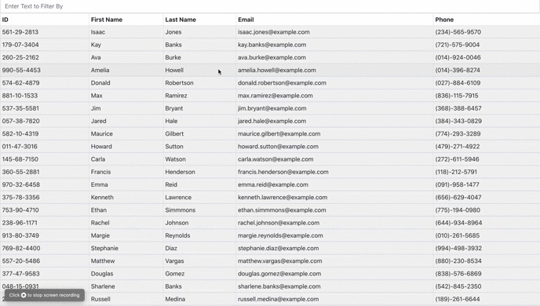

# Overview
This is a simple web application that displays a table of random users with an ID, First Name, Last Name, Email, and Phone number. This application allows the user to sort the table and also to search and find people by typing any of the column categories

### Click [here](https://desolate-falls-74318.herokuapp.com/) for a live demo

## How to use
<ol>
<li> Sorting:</li>
<ul>
<li>Click on one of the columns to sort the table by that column. This will either sort the table by numerical order or by alphabetical order</li>
</ul>

<li>Searching:</li>
<ul>
<li>In the search field begin typing ID numbers, names, emails, or phone numbers to bring up the name or names that match your search parameters</li>
</ul>

<li>And that's it!</li>
</ol>

## Technologies Used
<ul>
<li>React</li>
<li>Random User</li>
</ul>